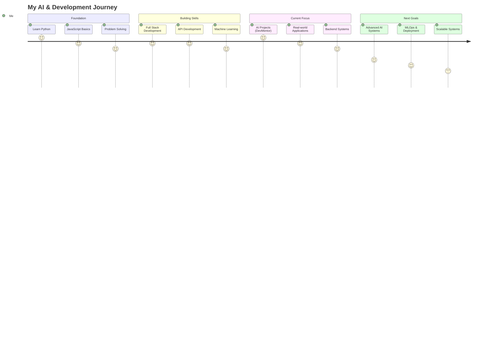

# 💫 About Me

🚀 I am an **Artificial Intelligence and Machine Learning (AIML) student** focused on building practical and scalable software solutions.

I specialize in developing **AI-powered applications and full-stack systems**, combining machine learning with modern web technologies to solve real-world problems.

I actively build and deploy projects to strengthen my skills in **machine learning, backend development, and system design**.

---

## 🎯 Current Focus
- AI/ML-based applications  
- Full-stack development  
- Real-world problem solving using AI  
- Backend & system design  

---

## 🌐 Portfolio

### 🚀 BuildLab (My Personal Portfolio)

🔗 https://build-lab-kappa.vercel.app

> A fully deployed portfolio showcasing my AI and full-stack projects

- Modern UI & responsive design  
- Dynamic project rendering  
- Built with scalability in mind  
- Deployed on Vercel  

---

## ⚡ Streak Stats

---

## 🛠️ Tech Stack

### 💻 Programming Languages

### 🤖 AI / Machine Learning

### 🌐 Web Development

### 🗄️ Databases

### 📊 Data Processing & Visualization

### ⚙️ Tools & Platforms

---

## 🗺️ My AI & Development Journey

---

## 🌐 Connect With Me

- GitHub: https://github.com/adityasing9  
- LinkedIn: https://www.linkedin.com/in/aaditya-singh-37594b3ba/  
- Email: to.msg.aadi@gmail.com  

---

## 📊 GitHub Stats

---

## 🏆 Achievements

---

## 🔥 Profile Views

