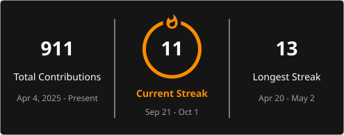

# 👋 Hi, I'm Aaditya Singh

### AIML Engineer • AI Builder • Full-Stack Developer

I build **practical software that solves real problems** — from AI-powered applications and intelligent tools to full-stack systems and developer utilities.

I'm currently pursuing a **B.E. in Artificial Intelligence & Machine Learning** and actively turning what I learn into working projects.

> **Build → Learn → Improve → Ship. 🚀**

---

## 🧠 What I Build

- 🤖 **AI & ML applications** — LLMs, RAG, automation and intelligent systems
- 🌐 **Full-stack applications** — modern frontend + backend architectures
- ⚙️ **Developer tools & automation** — utilities designed to save time and reduce friction
- 🔐 **Security & systems projects** — learning how software behaves from the inside
- 🧮 **Algorithms & problem solving** — DSA, optimization and practical algorithmic systems

---

## 🚧 Currently Exploring

- AI agents and automation
- Retrieval-Augmented Generation (RAG)
- Machine Learning systems
- Backend architecture & APIs
- Data structures and algorithms
- Scalable application design
- Deployment, DevOps and cloud infrastructure

---

## 🛠️ Tech Stack

### Languages

### AI / ML

### Web & Backend

### Databases

### Tools & Cloud

---

## 🚀 Selected Projects

| Project | What it is |
|---|---|
| 🧠 **Smart AI Study Assistant** | AI-powered study and document interaction system |
| 🛠️ **ToolKit** | Collection of practical developer and utility tools |
| 🔐 **CyberHash** | Security-focused hashing and cryptography project |
| 💻 **RCPC** | Remote computer control and management system |
| 🧩 **SettleHub** | Full-stack application for simplifying shared settlements |
| 📚 **StudyAI** | RAG-oriented AI study assistant |
| 🔒 **BidCrypt** | Secure / blockchain-oriented auction experimentation |
| 🌐 **BuildLab** | Personal project portfolio and experimentation hub |

👉 More projects are available across my repositories.

---

## 🌐 BuildLab

### My project laboratory

I use **BuildLab** to showcase projects, experiments and things I'm actively building.

🔗 **https://build-lab-kappa.vercel.app**

---

## 📊 GitHub

> 👀 Profile views are counted by Komarev's GitHub Profile Views Counter.

---

## 🔥 Contribution Streak

> Updated automatically every day using GitHub Actions.

---

## 🎯 My Approach

I don't want to just collect technologies.

I prefer to:

**Understand the problem → design the system → build it → test it → deploy it → improve it.**

Most of my repositories are experiments in turning an idea into something usable.

---

## 🤝 Connect

- 💼 [LinkedIn](https://www.linkedin.com/in/aaditya-singh-37594b3ba/)
- 💻 [GitHub](https://github.com/adityasing9)
- 🌐 [BuildLab](https://build-lab-kappa.vercel.app)

---

### ⚡ Building something every day.

